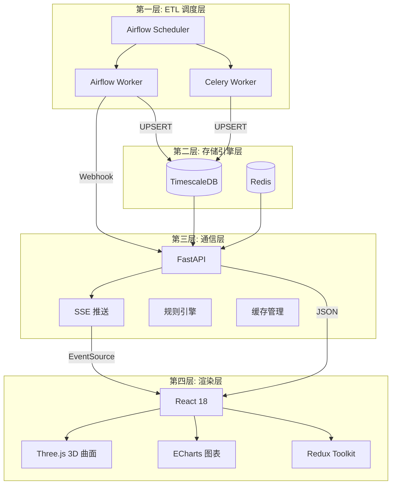

# 状态识别者 — 宏观流动性与资产定价状态识别系统

> **独立双轨控制模型 · 五组硬核物理数据 · 3D 收益率曲面 · SSE 实时推送**

[](https://www.python.org/)
[](https://fastapi.tiangolo.com/)
[](https://react.dev/)
[](https://www.docker.com/)
[](#license)

---

## 目录

- [项目概述](#项目概述)
- [系统架构](#系统架构)
- [技术栈清单](#技术栈清单)
- [项目目录结构](#项目目录结构)
- [快速启动指南](#快速启动指南)
- [五组 ETL 数据管道](#五组-etl-数据管道)
- [API 端点索引](#api-端点索引)
- [核心架构原则](#核心架构原则)
- [数据库表结构](#数据库表结构)
- [测试套件](#测试套件)
- [开发批次记录](#开发批次记录)
- [License 与免责声明](#license-与免责声明)

---

## 项目概述

### 系统定位

**"状态识别者"** 是一套面向机构投资者的宏观流动性监控终端，旨在通过自动化采集五组硬核物理数据，构建**独立双轨控制模型**，实时识别市场状态——精准区分 **"健康疼痛区"** 与 **"功能瘫痪区"**。

### 核心功能

| 功能模块 | 说明 |
|---------|------|
| **五组物理数据采集** | 通胀二阶导、财政增量、流动性走廊、AI CapEx、市场传染 |
| **独立双轨控制模型** | 第一轨：宏观立场（通胀加速度 40% + AI CapEx 30% + 工资动量 30%）<br>第二轨：流动性修补（SOFR-IORB 利差 50% + MOVE 指数 30% + 认购倍数 20%） |
| **3D 收益率曲面** | Three.js 实时渲染 1M-30Y 国债收益率曲面，支持形态标签（熊陡/熊平/正常） |
| **SSE 实时推送** | 废弃轮询，服务器主动推送状态变更与危机警报（毫秒级） |
| **规则引擎热更新** | 判定阈值运行时修改，无需重启服务 |
| **事件驱动缓存驱逐** | DAG Webhook → Redis DEL → SSE 广播，确保大屏读取最新状态 |

### 五大数据组

| 数据组 | 数据源 | 核心指标 |
|-------|--------|---------|
| 通胀二阶导 | FRED API | 核心 CPI 加速度、时薪 MoM、"薪柴复燃"预警 |
| 财政增量 | US Treasury API + FRED | 10Y/30Y 认购倍数、ACM 期限溢价、"熊陡"判定 |
| 流动性走廊 | FRED API | SOFR-IORB 利差、三级状态（充裕/紧张/瘫痪）、"水管爆裂"预警 |
| AI CapEx | SEC EDGAR XBRL | 7 大科技巨头季度 CapEx/R&D、动量指数 |
| 市场传染 | yfinance | SPY/TLT/MOVE 指数、30D/60D 滚动相关系数、传染警报 |

---

## 系统架构

```
┌─────────────────────────────────────────────────────────────────────┐
│                        Docker Compose 全栈编排                        │
├─────────────────────────────────────────────────────────────────────┤
│                                                                     │
│  ┌──────────────────── 第一层: ETL 调度层 ────────────────────────┐  │
│  │                                                                │  │
│  │  ┌──────────────┐   ┌──────────────┐   ┌──────────────────┐   │  │
│  │  │   Airflow     │   │   Airflow    │   │  Celery Worker   │   │  │
│  │  │  Scheduler    │──▶│   Worker     │   │  (SEC EDGAR)     │   │  │
│  │  │  (DAG 编排)   │   │  (FRED/财政) │   │  令牌桶 ≤10req/s │   │  │
│  │  └──────────────┘   └──────────────┘   └──────────────────┘   │  │
│  │                                                                │  │
│  │  5 组 DAG: liquidity │ inflation │ fiscal │ contagion │ maint  │  │
│  └────────────────────────────┬───────────────────────────────────┘  │
│                               │ UPSERT                              │
│                               ▼                                     │
│  ┌──────────────── 第二层: 存储引擎层 ───────────────────────────┐  │
│  │                                                                │  │
│  │  ┌──────────────────────┐   ┌──────────────────────────┐      │  │
│  │  │    TimescaleDB        │   │         Redis            │      │  │
│  │  │  (PostgreSQL 15)      │   │   (缓存 + 令牌桶 + MQ)    │      │  │
│  │  │                       │   │                          │      │  │
│  │  │  7 张超表 + 连续聚合   │   │  三级 TTL: 60s/300s/3600s│      │  │
│  │  │  UPSERT 无锁覆写       │   │  事件驱动强驱逐           │      │  │
│  │  │  WAL 归档 + 自动备份   │   │  maxmemory 512MB + LRU   │      │  │
│  │  └──────────┬───────────┘   └──────────┬───────────────┘      │  │
│  └─────────────┼──────────────────────────┼───────────────────────┘  │
│                │                          │                          │
│  ┌─────────────┼──── 第三层: 通信层 ───────┼──────────────────────┐  │
│  │             ▼                          ▼                       │  │
│  │  ┌──────────────────────────────────────────────────────┐     │  │
│  │  │                   FastAPI (Python)                     │     │  │
│  │  │                                                       │     │  │
│  │  │  ┌─────────┐ ┌──────────┐ ┌───────────┐ ┌────────┐  │     │  │
│  │  │  │Dashboard│ │Dual-Track│ │ Liquidity │ │Inflation│  │     │  │
│  │  │  │ Summary │ │  Status  │ │ Corridor  │ │  Trend  │  │     │  │
│  │  │  └─────────┘ └──────────┘ └───────────┘ └────────┘  │     │  │
│  │  │  ┌─────────┐ ┌──────────┐ ┌───────────┐ ┌────────┐  │     │  │
│  │  │  │Yield 3D │ │SSE Stream│ │Rules CRUD │ │Webhook │  │     │  │
│  │  │  │ Surface │ │  推送     │ │ 热更新    │ │缓存驱逐│  │     │  │
│  │  │  └─────────┘ └──────────┘ └───────────┘ └────────┘  │     │  │
│  │  └──────────────────────┬───────────────────────────────┘     │  │
│  └─────────────────────────┼─────────────────────────────────────┘  │
│                            │ JSON / SSE                             │
│                            ▼                                        │
│  ┌──────────────── 第四层: 渲染层 ──────────────────────────────┐  │
│  │                                                                │  │
│  │  ┌──────────────────────────────────────────────────────┐     │  │
│  │  │              React 18 + Vite + TypeScript              │     │  │
│  │  │                                                       │     │  │
│  │  │  ┌─────────────┐ ┌────────────┐ ┌────────────────┐   │     │  │
│  │  │  │ Three.js    │ │  ECharts   │ │  Tailwind CSS  │   │     │  │
│  │  │  │ 3D 收益率    │ │  利差/仪表盘│ │  暗色调响应式   │   │     │  │
│  │  │  │ 曲面渲染     │ │  /热力图    │ │  大屏布局       │   │     │  │
│  │  │  └─────────────┘ └────────────┘ └────────────────┘   │     │  │
│  │  │  ┌─────────────┐ ┌────────────┐ ┌────────────────┐   │     │  │
│  │  │  │ Redux TK    │ │ SSE Client │ │  双轨状态面板   │   │     │  │
│  │  │  │ 全局状态     │ │ Last-Ev-ID │ │  解码器弹窗     │   │     │  │
│  │  │  └─────────────┘ └────────────┘ └────────────────┘   │     │  │
│  │  └──────────────────────────────────────────────────────┘     │  │
│  └────────────────────────────────────────────────────────────────┘  │
└─────────────────────────────────────────────────────────────────────┘
```

### Mermaid 架构图



---

## 技术栈清单

| 层级 | 技术 | 版本 | 用途 |
|------|------|------|------|
| **前端** | React | 18.2 | UI 框架 |
| | Vite | 5.0 | 构建工具 |
| | TypeScript | 5.3 | 类型安全 |
| | Three.js | 0.160 | 3D 收益率曲面渲染 |
| | @react-three/fiber | 8.15 | React Three.js 集成 |
| | ECharts | 5.4 | 2D 图表（利差/仪表盘/热力图） |
| | Tailwind CSS | 3.4 | 暗色调响应式布局 |
| | Redux Toolkit | 2.0 | 全局状态管理 |
| | axios | 1.6 | HTTP 客户端 |
| **后端** | FastAPI | latest | 异步 API 框架 |
| | SQLAlchemy | async | ORM + 异步连接池 |
| | asyncpg | latest | PostgreSQL 异步驱动 |
| | sse-starlette | latest | SSE 推送 |
| | pydantic-settings | latest | 配置管理 |
| **ETL** | Apache Airflow | latest-pg15 | DAG 调度编排 |
| | Celery | latest | SEC EDGAR 独立队列 |
| | Pandas / NumPy | latest | 数据计算引擎 |
| | yfinance | latest | Yahoo Finance 数据 |
| | fredapi | latest | FRED API 客户端 |
| **存储** | TimescaleDB | latest-pg15 | 时序数据库 (PostgreSQL 15) |
| | Redis | 7-alpine | 缓存 + 令牌桶限流 + Celery Broker |
| **部署** | Docker Compose | 3.9 | 全栈容器化编排 (8 服务) |
| | Nginx | latest | 反向代理 (可选) |

---

## 项目目录结构

```
Macro-Data-Dashboard-PRD/
├── backend/                          # FastAPI 后端通信层
│   ├── app/
│   │   ├── services/                 # 业务服务层
│   │   │   ├── cache_manager.py      # Redis 缓存管理器 (三级TTL + 事件驱动驱逐)
│   │   │   ├── data_service.py       # 数据查询服务 (五组并行查询)
│   │   │   ├── rule_engine.py        # 规则引擎热更新 (双缓冲原子替换)
│   │   │   ├── state_engine.py       # 状态识别引擎 (紧缩指数 + 瘫痪仪表盘 + 双轨)
│   │   │   └── yield_curve_service.py# 3D 收益率曲面数据服务
│   │   ├── routers/                  # API 路由 (预留扩展)
│   │   ├── calculators/              # 后端计算模块 (预留)
│   │   ├── main.py                   # FastAPI 主入口 (SSE + API 端点 + Webhook)
│   │   ├── config.py                 # 全局配置 (pydantic-settings)
│   │   ├── database.py               # 异步数据库连接池 + Redis 连接
│   │   └── models.py                 # SQLAlchemy ORM 模型
│   ├── Dockerfile
│   └── requirements.txt
│
├── celery-worker/                    # SEC EDGAR 专用 Celery Worker
│   ├── app/
│   │   └── worker.py                 # XBRL 抓取 + CapEx 处理 + 令牌桶限流
│   ├── Dockerfile
│   └── requirements.txt
│
├── db/
│   └── init/
│       └── 01_init.sql               # TimescaleDB 初始化 (7张超表 + 索引 + 聚合)
│
├── docker/
│   └── airflow/
│       ├── dags/                     # Airflow DAG 编排
│       │   ├── lib/                  # 共享工具库
│       │   │   ├── calculators/      # 纯 Python 计算模块
│       │   │   │   ├── inflation_acceleration.py  # 3MMA + MoM + 加速度
│       │   │   │   ├── rolling_correlation.py     # 滚动皮尔逊相关系数
│       │   │   │   └── test_calculators.py        # 25+ 单元测试
│       │   │   ├── db_utils.py       # 数据库操作 (UPSERT + 批量写入 + 聚合刷新)
│       │   │   ├── rate_limiter.py   # 滑动窗口限流器 (FRED)
│       │   │   ├── secrets.py        # 三层密钥管理
│       │   │   ├── validators.py     # 数据质量验证 + 危机检测
│       │   │   ├── aggregate_validator.py  # 连续聚合一致性校验
│       │   │   └── backup_utils.py   # 自动备份工具
│       │   ├── liquidity_corridor_etl.py       # 流动性走廊 DAG
│       │   ├── inflation_acceleration_etl.py   # 通胀二阶导 DAG
│       │   ├── fiscal_auction_etl.py           # 财政增量 DAG
│       │   ├── market_contagion_etl.py         # 市场传染 DAG
│       │   └── db_maintenance.py               # 数据库维护 DAG
│       ├── Dockerfile
│       └── requirements.txt
│
├── frontend/                         # React 前端大屏
│   ├── src/
│   │   ├── components/               # UI 组件
│   │   │   ├── DashboardLayout.tsx   # 大屏基础布局 (Header/三栏/状态栏)
│   │   │   ├── YieldSurface3D.tsx    # Three.js 3D 曲面 (BufferGeometry + LOD + GC)
│   │   │   ├── ECharts.tsx           # ECharts 图表 (利差/仪表盘/热力图)
│   │   │   └── DualTrackPanels.tsx   # 双轨状态面板 + 解码器弹窗
│   │   ├── services/
│   │   │   └── sse.ts                # SSE 事件流服务 (Last-Event-ID + 降级轮询)
│   │   ├── stores/
│   │   │   └── index.ts              # Redux Toolkit Store (4 slice)
│   │   ├── App.tsx                   # 主应用组件
│   │   ├── main.tsx                  # 入口文件
│   │   └── index.css                 # Tailwind 全局样式
│   ├── Dockerfile
│   ├── package.json
│   ├── tailwind.config.js
│   ├── vite.config.ts
│   └── tsconfig.json
│
├── tests/                            # 测试套件
│   ├── test_consistency.py           # 数据一致性校验 (3MMA/加速度/相关系数)
│   ├── test_api_integration.py       # API 集成测试 (pytest + httpx)
│   ├── test_performance.py           # 性能基准测试 (计算/序列化/SSE/并发)
│   └── test_security.py              # 安全审查 (注入/XSS/CORS/泄露)
│
├── scripts/                          # 辅助脚本
├── docker-compose.yml                # 全栈编排 (8 服务容器)
├── .env.example                      # 环境变量模板
├── .gitignore
├── Macro Data Dashboard PRD.md       # 产品需求文档
└── 开发待办事项列表.md                # 开发 TODO 清单
```

---

## 快速启动指南

### 环境要求

| 工具 | 最低版本 | 说明 |
|------|---------|------|
| Docker | 20.10+ | 容器运行时 |
| Docker Compose | 2.0+ | 容器编排 |
| 内存 | 32 GB+ | 建议配置 (8 服务并发) |
| CPU | 8 核+ | 建议配置 |
| 磁盘 | 50 GB+ | TimescaleDB 数据 + WAL 归档 |

### 第一步: 克隆仓库

```bash
git clone https://github.com/raymodny-ai/Macro-Data-Dashboard-PRD.git
cd Macro-Data-Dashboard-PRD
```

### 第二步: 配置环境变量

```bash
cp .env.example .env
```

编辑 `.env` 文件，**必须填写**以下关键配置：

```ini
# 数据库密码 (修改默认密码!)
POSTGRES_PASSWORD=your_strong_password

# FRED API Key (必需) - https://fred.stlouisfed.org/docs/api/api_key.html
FRED_API_KEY=your_fred_api_key_here

# SEC EDGAR 合规请求头 (必需)
SEC_COMPANY_NAME=YourCompanyName
SEC_CONTACT_EMAIL=your@email.com

# Webhook 密钥 (DAG → 缓存驱逐)
WEBHOOK_SECRET=your_webhook_secret
```

### 第三步: 启动全栈服务

```bash
docker-compose up -d --build
```

### 第四步: 验证服务状态

```bash
# 查看所有容器状态
docker-compose ps

# 验证 FastAPI 健康检查
curl http://localhost:8000/health

# 查看 Airflow Webserver
# 浏览器访问 http://localhost:8080 (admin / admin)
```

### 服务访问地址

| 服务 | 地址 | 说明 |
|------|------|------|
| **前端大屏** | `http://localhost:3000` | React + Three.js 3D 大屏 |
| **FastAPI** | `http://localhost:8000` | 后端 API |
| **API 文档** | `http://localhost:8000/docs` | Swagger UI |
| **ReDoc** | `http://localhost:8000/redoc` | API 文档 (ReDoc) |
| **Airflow** | `http://localhost:8080` | DAG 管理 (admin/admin) |
| **TimescaleDB** | `localhost:5432` | PostgreSQL 连接 |
| **Redis** | `localhost:6379` | Redis 连接 |

---

## 五组 ETL 数据管道

### 1. 通胀二阶导组

| 项目 | 说明 |
|------|------|
| **DAG** | `inflation_acceleration_etl.py` |
| **数据源** | FRED API — CPILFESL(核心CPI) + 4条时薪序列 |
| **调度频率** | 每月 2-8 日工作日 UTC 14:00 |
| **计算逻辑** | 3MMA 平滑 → MoM 环比增速 → 二阶加速度 → "薪柴复燃"预警 |
| **预警条件** | 连续两月加速度 > 0 且斜率扩大 |

### 2. 财政增量组

| 项目 | 说明 |
|------|------|
| **DAG** | `fiscal_auction_etl.py` |
| **数据源** | US Treasury Fiscal Data API + FRED (THREEFYTP10 ACM溢价) |
| **调度频率** | 每月 2-8 日工作日 UTC 14:00 |
| **计算逻辑** | 解析拍卖数据 → 提取 bid_to_cover / tail_spread → 熊陡判定 |
| **预警条件** | 连续认购倍数 < 2.4 AND ACM > 0.01 → fiscal_warning_flag |

### 3. 流动性走廊组

| 项目 | 说明 |
|------|------|
| **DAG** | `liquidity_corridor_etl.py` |
| **数据源** | FRED API — SOFR + IORB 日度数据 |
| **调度频率** | T-180 滚动全量覆盖 |
| **计算逻辑** | spread = SOFR - IORB → 三级状态判定 → "水管爆裂"预警 |
| **状态触发器** | 0: 充裕 (< -0.03) / 1: 紧张 (-0.03~0) / 2: 瘫痪 (> 0) |

### 4. AI CapEx 组

| 项目 | 说明 |
|------|------|
| **Worker** | `celery-worker/app/worker.py` |
| **数据源** | SEC EDGAR XBRL — 7 大科技巨头 (AAPL/NVDA/MSFT/GOOGL/TSLA/META/AMZN) |
| **调度方式** | Celery chord 批量并行 (令牌桶 ≤10 req/s) |
| **计算逻辑** | 提取季度 CapEx/R&D → MoM/YoY 增速 → 加权汇总动量指数 |

### 5. 市场传染组

| 项目 | 说明 |
|------|------|
| **DAG** | `market_contagion_etl.py` |
| **数据源** | yfinance — SPY + TLT + ^MOVE |
| **调度频率** | T-180 滚动全量覆盖 |
| **计算逻辑** | 复权收盘价 → 对数收益率 → 30D/60D 滚动皮尔逊相关系数 |
| **预警条件** | SPY 跌幅 >2% AND 30D相关系数 >0.5 AND MOVE >120 → contagion_alert |

---

## API 端点索引

### 数据查询

| 方法 | 路径 | 说明 | 缓存 TTL |
|------|------|------|----------|
| `GET` | `/api/v1/dashboard/summary` | 五组数据聚合摘要 | 3600s |
| `GET` | `/api/v1/dual-track/status` | 独立双轨状态判定 | 3600s |
| `GET` | `/api/v1/liquidity/corridor` | 流动性走廊时序 (支持分页) | 300s |
| `GET` | `/api/v1/inflation/trend` | 通胀二阶导趋势分析 | 300s |
| `GET` | `/api/v1/yield-curve/3d-surface` | 3D 收益率曲面压缩二维数组 | 1800s |

### SSE 推送

| 方法 | 路径 | 说明 |
|------|------|------|
| `GET` | `/api/v1/events/stream` | SSE 实时事件流 (30s 心跳, Last-Event-ID 重连) |

事件类型: `connected` / `data_updated` / `cache_invalidated` / `state_change` / `crisis_alert` / `rules_updated` / `heartbeat`

### 规则管理

| 方法 | 路径 | 说明 |
|------|------|------|
| `GET` | `/api/v1/rules` | 获取全部规则阈值 |
| `GET` | `/api/v1/rules/{group}` | 按组获取规则 (liquidity/fiscal/dual_track/contagion/quality) |
| `PUT` | `/api/v1/rules/{rule_name}` | 热更新单条规则 (DB→内存→Redis 原子替换) |
| `POST` | `/api/v1/rules/refresh` | 强制从 DB 刷新全部规则 |

### 内部接口

| 方法 | 路径 | 说明 |
|------|------|------|
| `POST` | `/api/v1/internal/cache-invalidate` | DAG Webhook 缓存驱逐 (需 `x-webhook-secret` 认证) |
| `GET` | `/health` | 服务健康检查 |
| `GET` | `/docs` | Swagger UI 文档 |
| `GET` | `/openapi.json` | OpenAPI 规范 |

### 查询参数示例

```bash
# 流动性走廊 (分页 + 日期范围)
GET /api/v1/liquidity/corridor?start_date=2024-01-01&end_date=2024-06-01&limit=180&offset=0

# 3D 收益率曲面
GET /api/v1/yield-curve/3d-surface?limit_days=180

# 热更新规则
PUT /api/v1/rules/spread_stress_threshold
Body: {"value": 0.05}
```

---

## 核心架构原则

### 1. T-180 滚动全量覆盖

每次 DAG 触发均拉取过去 **180 天**全量数据进行幂等写入（`ON CONFLICT DO UPDATE`），利用算力换取数据状态与官方（FRED 修正后）的**绝对一致**。彻底摒弃增量更新与级联重算。

### 2. 双层限流隔离

| 层级 | 接口类型 | 限流方式 | 示例 |
|------|---------|---------|------|
| Airflow Worker 进程内 | 宽容接口 | 滑动窗口限流 | FRED API / US Treasury |
| 独立 Celery + Redis Lua | 严苛接口 | 令牌桶 ≤10 req/s | SEC EDGAR XBRL |

### 3. UPSERT 无锁覆写

所有超表均配置 `(record_date, symbol)` 联合唯一约束，通过 `INSERT ... ON CONFLICT DO UPDATE` 实现无锁幂等写入。大批量场景使用 `COPY + 临时表 + INSERT ON CONFLICT` 降低 WAL 压力。

### 4. SSE 主动推送 + 事件驱动缓存驱逐

```
DAG 写入完成 → Webhook POST → Redis cache:* DEL
                              → SSE broadcast(data_updated)
                              → 大屏接收事件 → 重新拉取最新数据
```

- **废弃轮询**: 服务器主动推送，毫秒级状态广播
- **Last-Event-ID**: 环形缓冲 100 条事件历史，断线重连自动补发
- **降级轮询**: 10 次重连失败后降级为 30s 短轮询保底

### 5. 压缩二维数组传输 + WebGL GC

```
后端: yields[180][8] 压缩二维数组 (dates + terms + yields[][])
      ↓ JSON (约 20KB)
前端: BufferGeometry 本地生成 (PlaneGeometry + vertexColors)
      ↓ WebGL 渲染
GC:   geometry.dispose() + material.dispose() + renderer.forceContextLoss()
LOD:  帧率监测 → 自动降级 (100 → 50 → 25 segments)
```

- **严禁传输庞大 JSON 网格** (vertices/faces/colors)，网络开销降低 90%+
- **7×24 挂机零内存泄漏**: 显式 WebGL GC + LOD 自动降级

---

## 数据库表结构

### 超表一览

| 表名 | 时间分区键 | 唯一约束 | 说明 |
|------|-----------|---------|------|
| `inflation_data` | `record_date` | `(record_date, symbol)` | 核心 CPI + 时薪 + 3MMA + MoM + 加速度 |
| `fiscal_auction_data` | `auction_date` | `(auction_date, security_type)` | 10Y/30Y 拍卖 + 认购倍数 + ACM 溢价 |
| `liquidity_corridor` | `record_date` | `(record_date, symbol)` | SOFR + IORB + 利差 + system_state |
| `ai_capex_data` | `report_date` | `(report_date, company_cik)` | 科技巨头 CapEx + R&D + 增速 |
| `market_contagion` | `trade_date` | `(trade_date, symbol)` | SPY/TLT/MOVE + 滚动相关系数 |
| `treasury_yields` | `record_date` | `(record_date, symbol)` | 8 个期限国债收益率 (1M-30Y) |

### 关键字段说明

**inflation_data**

| 字段 | 类型 | 说明 |
|------|------|------|
| `value` | NUMERIC(16,6) | 原始值 (CPI 指数 / 时薪美元) |
| `three_mma` | NUMERIC(12,8) | 三个月移动平均 |
| `mom_growth` | NUMERIC(12,8) | 环比增速 (MoM) |
| `acceleration` | NUMERIC(12,8) | 二阶加速度 (当前3MMA - 前置3MMA) |
| `warning_flag` | BOOLEAN | "薪柴复燃"预警标记 |

**liquidity_corridor**

| 字段 | 类型 | 说明 |
|------|------|------|
| `sofr_rate` | NUMERIC(8,6) | 担保隔夜融资利率 |
| `iorb_rate` | NUMERIC(8,6) | 准备金余额利率 |
| `spread` | NUMERIC(8,6) | SOFR - IORB 利差 |
| `system_state` | SMALLINT | 0=充裕 / 1=紧张 / 2=瘫痪 |
| `crisis_alert` | BOOLEAN | "水管爆裂"预警 |

### 辅助表

| 表名 | 说明 |
|------|------|
| `rules_config` | 规则引擎阈值配置 (热更新, PK: rule_name) |
| `db_maintenance_log` | VACUUM ANALYZE 执行日志 |
| `backup_schedule` | 自动备份策略配置 (daily_full + wal_continuous) |
| `spread_percentiles_30d` | 连续聚合视图 — 利差 30/50/70/90 分位数 |

---

## 测试套件

### 测试文件

| 文件 | 类型 | 覆盖范围 |
|------|------|---------|
| `test_consistency.py` | 数据一致性 | 3MMA 计算、二阶加速度、滚动相关系数、误差 <0.01% |
| `test_api_integration.py` | API 集成 | 健康检查/仪表板/双轨/流动性/通胀/规则/3D曲面/SSE/Webhook |
| `test_performance.py` | 性能基准 | 计算(3MMA/加速度)/序列化/SSE广播/缓存/并发 5 大类 |
| `test_security.py` | 安全审查 | Webhook认证绕过/SQL注入/XSS防护/CORS/敏感信息泄露/输入边界 |

### 运行方式

```bash
# 运行全部测试
python -m pytest tests/ -v --asyncio-mode=auto

# 仅运行性能基准 (独立运行, 生成报告)
python tests/test_performance.py

# 仅运行安全审查
python -m pytest tests/test_security.py -v --asyncio-mode=auto

# 仅运行 API 集成测试
python -m pytest tests/test_api_integration.py -v --asyncio-mode=auto
```

### 性能基准指标

| 测试项 | 阈值 |
|--------|------|
| 3MMA 1000 点滚动计算 | < 5ms |
| 滚动相关系数 500 点 (60日窗口) | < 50ms |
| 压缩二维数组序列化 (180天×8期限) | < 5ms |
| SSE 广播 100 事件 × 5 客户端 | < 10ms |
| 规则引擎内存读取 × 10000 | < 5ms |
| 50 并发缓存计算 | < 100ms |

---

## 开发批次记录

| 批次 | 名称 | 完成功能 |
|------|------|---------|
| **B0** | 物理底座就绪 | Docker Compose 8 服务容器 + TimescaleDB 超表 + Redis + Airflow + 前端脚手架 |
| **B1** | 管道层 MVP | 流动性走廊 T-180 DAG 8 步流水线 + Celery 令牌桶 + 连续聚合按需刷新 |
| **B2** | 存储层验证 | UPSERT 批量写入 + Python 计算模块 (3MMA/相关系数) + 25+ 单元测试 + DB 维护 DAG |
| **B3** | 全量 ETL | 通胀/财政/市场传染 3 组 DAG + Celery SEC XBRL 抓取 + 三层密钥管理 |
| **B4** | 通信层 MVP | FastAPI 全量 API + SSE 推送 (Last-Event-ID) + Redis 缓存驱逐 + 规则引擎热更新 |
| **B5** | 渲染层 MVP | Three.js 3D 曲面 (BufferGeometry + LOD + GC) + ECharts 图表 + 双轨面板 + 解码器弹窗 |
| **B6** | 集成与穿透 | 3D 收益率曲面 API (8 FRED 序列) + 形态判定 + treasury_yields 表 |
| **B7** | 全链路验收 | 一致性校验 + API 集成测试 + 性能基准 + 安全审查 (30+ 测试用例) |

---

## License 与免责声明

### MIT License

```
Copyright (c) 2024-2026 Macro Data Dashboard PRD

Permission is hereby granted, free of charge, to any person obtaining a copy
of this software and associated documentation files (the "Software"), to deal
in the Software without restriction, including without limitation the rights
to use, copy, modify, merge, publish, distribute, sublicense, and/or sell
copies of the Software, and to permit persons to whom the Software is
furnished to do so, subject to the following conditions:

The above copyright notice and this permission notice shall be included in all
copies or substantial portions of the Software.

THE SOFTWARE IS PROVIDED "AS IS", WITHOUT WARRANTY OF ANY KIND, EXPRESS OR
IMPLIED, INCLUDING BUT NOT LIMITED TO THE WARRANTIES OF MERCHANTABILITY,
FITNESS FOR A PARTICULAR PURPOSE AND NONINFRINGEMENT. IN NO EVENT SHALL THE
AUTHORS OR COPYRIGHT HOLDERS BE LIABLE FOR ANY CLAIM, DAMAGES OR OTHER
LIABILITY, WHETHER IN AN ACTION OF CONTRACT, TORT OR OTHERWISE, ARISING FROM,
OUT OF OR IN CONNECTION WITH THE SOFTWARE OR THE USE OR OTHER DEALINGS IN THE
SOFTWARE.
```

### 免责声明

> **本系统仅供技术研究与教育用途，不构成任何投资建议。**
>
> 1. 本系统采集的所有数据均来自公开金融数据源（FRED、US Treasury、SEC EDGAR、Yahoo Finance），不涉及个人隐私数据。
> 2. 系统输出的"状态识别"结果基于历史数据的数学模型推演，**不代表对未来市场走势的预测或保证**。
> 3. 使用本系统进行投资决策所产生的一切风险与损失，由用户自行承担，开发者不承担任何法律责任。
> 4. 请遵守各数据源的 API 使用条款与访问频率限制，特别是 SEC EDGAR 的[公平访问规则](https://www.sec.gov/os/webmaster-faq#developers)（≤10 请求/秒）。
> 5. 金融数据存在延迟与修正的可能，FRED 等官方数据源会对历史数据进行回溯修正（Revision），本系统通过 T-180 全量覆盖策略确保数据一致性，但不保证实时性。

---

<p align="center">
  <strong>状态识别者</strong> — 在清算主义范式下，精准识别市场状态
</p>
